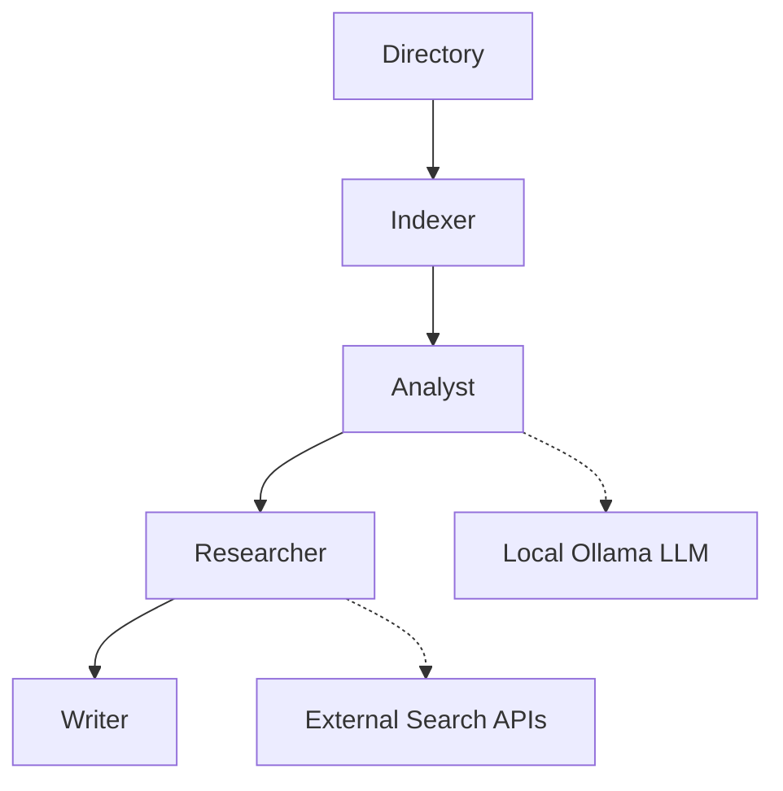

# LangGraph Code Analysis Agent - Technical Architecture

> **⚠️ PROJECT STATUS: EXPERIMENTAL & "NOT VERY GOOD" (YET)**
> This project is currently a rough prototype. It is functional, but far from perfect. It was built as a proof-of-concept for unrestricted security research.
> **The Good News:** The project actually used its own logic to suggest many of the improvements and security warnings seen in this documentation! It is "working," but it needs a human touch.
> **Contributions Welcome:** If you see something broken, inefficient, or just plain "not very good," please fork it and improve it. This is a community-driven research tool.

## System Overview

A LangGraph-based autonomous code analysis system designed for **unrestricted cybersecurity research**. This tool implements a zero-safety-guard approach to analyze potentially malicious code, exploits, and vulnerabilities without AI content filtering restrictions.

## 📚 External Documentation & Resources

To understand the underlying technologies used here, please refer to:

* **[Ollama Documentation](https://github.com/ollama/ollama/tree/main/docs)**: For local LLM orchestration.
* **[LangChain Documentation](https://python.langchain.com/docs/introduction/)**: The framework for LLM application development.
* **[LangGraph Documentation](https://langchain-ai.github.io/langgraph/)**: For building stateful, multi-agent execution graphs.

---

## Core Architecture

### Processing Pipeline



### Node Specifications

#### **Node 1: Indexer**

* **Function**: File system crawler with `.git` exclusion.
* **Mechanics**: Non-recursive directory scanning.

#### **Node 2: Analyst**

* **Core**: Local LLM analysis via Ollama.
* **Capabilities**: Code pattern recognition and logic analysis.

#### **Node 3: Researcher**

* **Function**: Gathers threat intelligence via Tavily or Google Serper.
* **Trigger**: Activated by "suspicious" patterns found by the Analyst.

#### **Node 4: Writer**

* **Function**: Generates three distinct markdown reports (Technical, Threat, and Executive).

---

## Technical Specifications

### State Management Structure

```python
class AgentState(TypedDict):
    folder_path: str            # Target directory path
    files: List[str]            # Discovered file paths
    file_summaries: Dict[str, str]  # LLM analysis per file
    research_context: str       # External search results
    final_docs: Dict[str, str]  # Generated documentation

```

---

## Operational Requirements

### **Environment Setup**

```bash
# Prerequisites
Python 3.10+
Ollama running locally
UV package manager

# Installation
uv sync
cp .env.example .env  # Configure your API keys

```

### **Ollama Configuration**

If you don't have Ollama installed, run:

```bash
curl -fsSL https://ollama.com/install.sh | sh

```

The system is tested with high-parameter models. For local or cloud-based execution:

```bash
# Example for pull a high-end model
ollama pull mistral-large-3:675b-cloud

```

---

## Security Architecture & Defensive Gaps

**Warning:** Because this project prioritizes "Unrestricted Analysis," it currently lacks several standard protections:

* **No Sandboxing:** Analyzed code is read directly; use a VM for safety.
* **Input Risks:** Missing path sanitization.
* **API Exposure:** Search queries might leak names of private functions to external APIs.

**Self-Improvement Note:** The "Planned Enhancements" section below was largely generated by the agent itself after analyzing its own source code!

### **Development Roadmap**

1. **Security Hardening**: Adding sandboxed execution environments.
2. **Parallelism**: Processing files in parallel instead of sequentially.
3. **Recursive Scanning**: Allowing the indexer to dive into subdirectories.

---

## Disclaimer

**WARNING**: This tool is designed exclusively for controlled cybersecurity research. It intentionally removes safety guardrails. Use only in isolated environments.

---

*This documentation was partially generated and improved by the LangGraph Code Analysis Agent v0.1.0*

---

